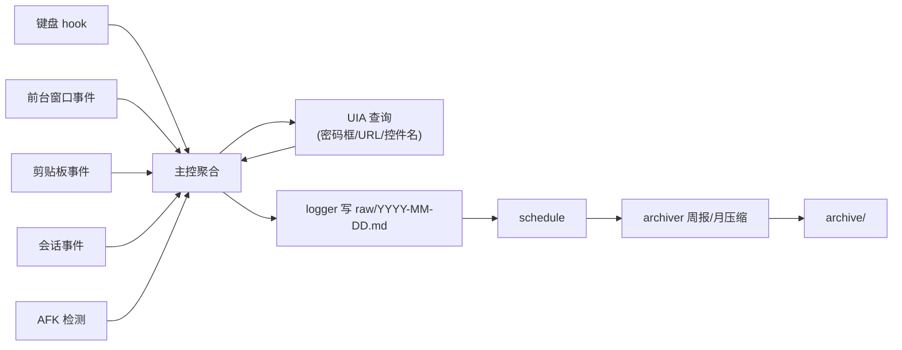

# 文件结构与模块设计

## 目录结构

```
%LOCALAPPDATA%\WorkLog\
├─ tracker.py              主入口
├─ config.json             配置（AFK 阈值/截断长度/排除窗口等）
├─ modules\
│  ├─ window_watcher.py    前台窗口监听
│  ├─ keyboard_watcher.py  键盘 Hook + 聚合
│  ├─ clipboard_watcher.py 剪贴板监听
│  ├─ uia_helper.py        UIA 控件查询/密码框识别/URL 读取
│  ├─ idle_detector.py     AFK 检测
│  ├─ session_watcher.py   锁屏/解锁事件
│  ├─ logger.py            日志写入
│  └─ archiver.py          周归档/月压缩
├─ raw\                    按天 md，永不删
│  ├─ 2026-05-12.md
│  └─ ...
├─ archive\                周报与压缩
│  ├─ 2026-W19-summary.md
│  ├─ 2026-04.zip          月度压缩历史 raw
│  └─ ...
└─ error.log               静默错误日志
```

## 模块职责

### 主控 [tracker.py](http://tracker.py)

- 启动时获取**单实例锁**（命名互斥量 Mutex）
- 加载 `config.json`
- 初始化各 watcher（独立线程或异步）
- 注册全局异常 hook → 写 `error.log`，**绝不抛出**
- 主循环：每秒触发一次聚合写入

### window_watcher

- 监听 WinEvent `EVENT_SYSTEM_FOREGROUND`
- 切换时记录新窗口 进程名 + 标题
- 调用 uia_helper 拿浏览器 URL
- 推事件给 logger

### keyboard_watcher

- pynput 全局 hook
- 内存里按「当前窗口」维护 buffer
- 普通字符聚合计数 + 拼接（**仅英文数字**，中文跳过）
- 修饰键组合单独捕获
- 窗口切换 / 焦点切换 / Enter / Tab 时**结算 buffer 写日志**
- 调用 uia_helper 检查当前控件是否密码框，是则**丢弃这一段**

### clipboard_watcher

- 注册 `WM_CLIPBOARDUPDATE` 事件
- 变化时读剪贴板，识别类型（文本/图片/文件）
- 文本截断：长度 > 200 取前 50 + 后 20 + 总长
- 关联 Ctrl+V 推断粘贴动作
- 1 秒去重（防止某些应用高频读写）

### uia_helper

- 封装 uiautomation 调用，所有查询加 **200ms 超时**
- 判断焦点控件是否 `IsPassword`
- 读浏览器地址栏（Chrome/Edge/Firefox 适配）
- 读普通 input 当前值（用于自动填充识别）
- 检测 IME 是否激活

### idle_detector

- Win API `GetLastInputInfo`
- 5 分钟无输入 → `[IDLE_START]`
- 恢复输入 → `[IDLE_END]` 带时长

### session_watcher

- 注册 WTS 会话事件
- `WTS_SESSION_LOCK` → `[LOCK]`
- `WTS_SESSION_UNLOCK` → `[UNLOCK]`

### logger

- 按天打开 `raw\YYYY-MM-DD.md`
- 追加写，**每行后立即 flush**
- 文件超过 10MB 自动分片（几乎不会触发）

### archiver

- schedule 每周日凌晨 3 点跑一次
- 读上周 7 天 raw，生成 `archive\YYYY-WXX-summary.md`
- 内容：每天每应用累计时长 / Top 10 网页 / 键盘活跃曲线 / 异常空闲
- 每月 1 号 4 点把**上月 raw 压成 zip**（原始 .md 保留）

## 配置文件 config.json

```json
{
  "log_dir": "%LOCALAPPDATA%\\WorkLog",
  "afk_threshold_sec": 300,
  "text_truncate_length": 200,
  "text_truncate_keep_head": 50,
  "text_truncate_keep_tail": 20,
  "exclude_window_titles": ["password", "登录", "支付", "银行"],
  "key_burst_interval_sec": 30,
  "uia_query_timeout_ms": 200,
  "weekly_archive_cron": "0 3 * * 0",
  "monthly_compress_cron": "0 4 1 * *",
  "single_instance_mutex_name": "Global\\WorkLogTrackerMutex"
}
```

## 异常处理铁律

<aside>
⚠️

**任何异常绝不弹窗。** 这是这个项目的最高原则，违反任何一条都视为 bug。

</aside>

- 任何异常都 `try/except`，catch 到的写 `error.log`
- 绝不 `print`，绝不 `messagebox`，绝不 `input()`
- 模块崩溃自动重启该模块（线程级），不影响主进程
- 主进程崩溃由任务计划程序兜底
- `error.log` 满 5MB 自动滚动（`error.log.1` 备份）

## 数据流



## 性能预算

- 内存：30-50 MB
- CPU：空闲时 <0.5%，活跃时 <2%
- 磁盘：单日日志 200KB-1MB，月压缩后约 5-10MB